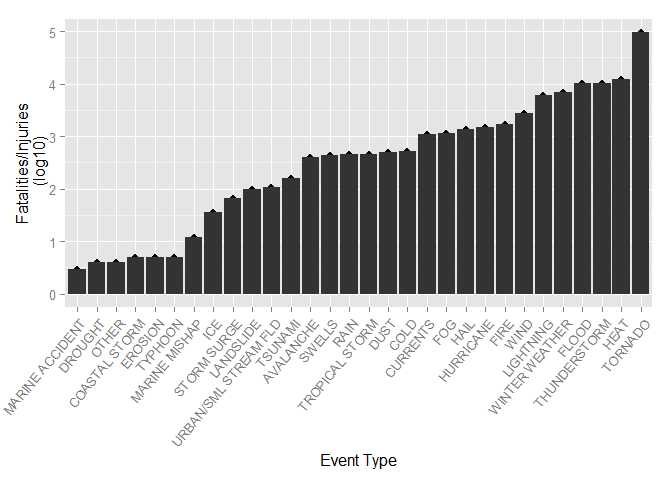
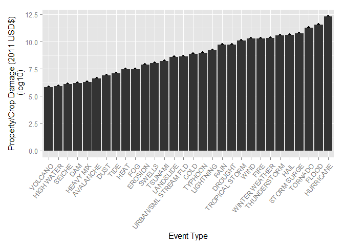
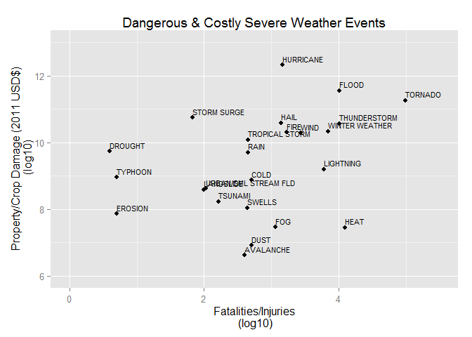

# Severe Weather Health and Economic Effects (Reproducible Research: Peer Assessment 2)

##Synopsis

In this report, we examine extreme weather events for their life and economic costs. Through National Oceanic and Atmospheric Administration's (NOAA) storm database, we can see which major storm and weather events cause the most damage to property and crops and the most fatalities and injuries.

The most dangerous events to life and injuries were tornadoes, heat, thunderstorms, floods, and winter weather.

The most costly events to the economy were hurricanes, floods, tornadoes, storm surges, and hail.

Tornadoes, hurricanes, and flooding were in the top five for each factor.

##Data Processing


```r
library(R.utils)
library(data.table)
library(ggplot2)
library(quantmod)
library(RCurl)
library(bitops)
```

First, we obtain the data from the [course website](https://d396qusza40orc.cloudfront.net/repdata%2Fdata%2FStormData.csv.bz2), with additional information [here](https://d396qusza40orc.cloudfront.net/repdata%2Fpeer2_doc%2Fpd01016005curr.pdf) and answers to [FAQ](https://d396qusza40orc.cloudfront.net/repdata%2Fpeer2_doc%2FNCDC%20Storm%20Events-FAQ%20Page.pdf).

```r
download.file("http://d396qusza40orc.cloudfront.net/repdata%2Fdata%2FStormData.csv.bz2", destfile="repdata-data-StormData.csv.bz2")

bunzip2("repdata-data-StormData.csv.bz2", overwrite=TRUE, remove=FALSE)
```

Now, assign the newly created *.csv file to a data frame

```r
data <- read.csv("repdata-data-StormData.csv")
```

Explore the data frame

```r
dim(data)
```

```
## [1] 902297     37
```

```r
head(data, n=4)
```

```
##   STATE__          BGN_DATE BGN_TIME TIME_ZONE COUNTY COUNTYNAME STATE
## 1       1 4/18/1950 0:00:00     0130       CST     97     MOBILE    AL
## 2       1 4/18/1950 0:00:00     0145       CST      3    BALDWIN    AL
## 3       1 2/20/1951 0:00:00     1600       CST     57    FAYETTE    AL
## 4       1  6/8/1951 0:00:00     0900       CST     89    MADISON    AL
##    EVTYPE BGN_RANGE BGN_AZI BGN_LOCATI END_DATE END_TIME COUNTY_END
## 1 TORNADO         0                                               0
## 2 TORNADO         0                                               0
## 3 TORNADO         0                                               0
## 4 TORNADO         0                                               0
##   COUNTYENDN END_RANGE END_AZI END_LOCATI LENGTH WIDTH F MAG FATALITIES
## 1         NA         0                      14.0   100 3   0          0
## 2         NA         0                       2.0   150 2   0          0
## 3         NA         0                       0.1   123 2   0          0
## 4         NA         0                       0.0   100 2   0          0
##   INJURIES PROPDMG PROPDMGEXP CROPDMG CROPDMGEXP WFO STATEOFFIC ZONENAMES
## 1       15    25.0          K       0                                    
## 2        0     2.5          K       0                                    
## 3        2    25.0          K       0                                    
## 4        2     2.5          K       0                                    
##   LATITUDE LONGITUDE LATITUDE_E LONGITUDE_ REMARKS REFNUM
## 1     3040      8812       3051       8806              1
## 2     3042      8755          0          0              2
## 3     3340      8742          0          0              3
## 4     3458      8626          0          0              4
```

```r
str(data)
```

```
## 'data.frame':	902297 obs. of  37 variables:
##  $ STATE__   : num  1 1 1 1 1 1 1 1 1 1 ...
##  $ BGN_DATE  : Factor w/ 16335 levels "1/1/1966 0:00:00",..: 6523 6523 4242 11116 2224 2224 2260 383 3980 3980 ...
##  $ BGN_TIME  : Factor w/ 3608 levels "00:00:00 AM",..: 272 287 2705 1683 2584 3186 242 1683 3186 3186 ...
##  $ TIME_ZONE : Factor w/ 22 levels "ADT","AKS","AST",..: 7 7 7 7 7 7 7 7 7 7 ...
##  $ COUNTY    : num  97 3 57 89 43 77 9 123 125 57 ...
##  $ COUNTYNAME: Factor w/ 29601 levels "","5NM E OF MACKINAC BRIDGE TO PRESQUE ISLE LT MI",..: 13513 1873 4598 10592 4372 10094 1973 23873 24418 4598 ...
##  $ STATE     : Factor w/ 72 levels "AK","AL","AM",..: 2 2 2 2 2 2 2 2 2 2 ...
##  $ EVTYPE    : Factor w/ 985 levels "   HIGH SURF ADVISORY",..: 834 834 834 834 834 834 834 834 834 834 ...
##  $ BGN_RANGE : num  0 0 0 0 0 0 0 0 0 0 ...
##  $ BGN_AZI   : Factor w/ 35 levels "","  N"," NW",..: 1 1 1 1 1 1 1 1 1 1 ...
##  $ BGN_LOCATI: Factor w/ 54429 levels "","- 1 N Albion",..: 1 1 1 1 1 1 1 1 1 1 ...
##  $ END_DATE  : Factor w/ 6663 levels "","1/1/1993 0:00:00",..: 1 1 1 1 1 1 1 1 1 1 ...
##  $ END_TIME  : Factor w/ 3647 levels ""," 0900CST",..: 1 1 1 1 1 1 1 1 1 1 ...
##  $ COUNTY_END: num  0 0 0 0 0 0 0 0 0 0 ...
##  $ COUNTYENDN: logi  NA NA NA NA NA NA ...
##  $ END_RANGE : num  0 0 0 0 0 0 0 0 0 0 ...
##  $ END_AZI   : Factor w/ 24 levels "","E","ENE","ESE",..: 1 1 1 1 1 1 1 1 1 1 ...
##  $ END_LOCATI: Factor w/ 34506 levels "","- .5 NNW",..: 1 1 1 1 1 1 1 1 1 1 ...
##  $ LENGTH    : num  14 2 0.1 0 0 1.5 1.5 0 3.3 2.3 ...
##  $ WIDTH     : num  100 150 123 100 150 177 33 33 100 100 ...
##  $ F         : int  3 2 2 2 2 2 2 1 3 3 ...
##  $ MAG       : num  0 0 0 0 0 0 0 0 0 0 ...
##  $ FATALITIES: num  0 0 0 0 0 0 0 0 1 0 ...
##  $ INJURIES  : num  15 0 2 2 2 6 1 0 14 0 ...
##  $ PROPDMG   : num  25 2.5 25 2.5 2.5 2.5 2.5 2.5 25 25 ...
##  $ PROPDMGEXP: Factor w/ 19 levels "","-","?","+",..: 17 17 17 17 17 17 17 17 17 17 ...
##  $ CROPDMG   : num  0 0 0 0 0 0 0 0 0 0 ...
##  $ CROPDMGEXP: Factor w/ 9 levels "","?","0","2",..: 1 1 1 1 1 1 1 1 1 1 ...
##  $ WFO       : Factor w/ 542 levels ""," CI","$AC",..: 1 1 1 1 1 1 1 1 1 1 ...
##  $ STATEOFFIC: Factor w/ 250 levels "","ALABAMA, Central",..: 1 1 1 1 1 1 1 1 1 1 ...
##  $ ZONENAMES : Factor w/ 25112 levels "","                                                                                                                               "| __truncated__,..: 1 1 1 1 1 1 1 1 1 1 ...
##  $ LATITUDE  : num  3040 3042 3340 3458 3412 ...
##  $ LONGITUDE : num  8812 8755 8742 8626 8642 ...
##  $ LATITUDE_E: num  3051 0 0 0 0 ...
##  $ LONGITUDE_: num  8806 0 0 0 0 ...
##  $ REMARKS   : Factor w/ 436774 levels "","-2 at Deer Park\n",..: 1 1 1 1 1 1 1 1 1 1 ...
##  $ REFNUM    : num  1 2 3 4 5 6 7 8 9 10 ...
```

Let's see how many events occur each year

```r
data$BGN_DATE2 <- as.Date(data$BGN_DATE, format="%m/%d/%Y %H:%M:%S")
data$year <- as.numeric(format(data$BGN_DATE2, "%Y"))

Events_Year <- data.frame(summary(as.factor(data$year)))
Events_Year
```

```
##      summary.as.factor.data.year..
## 1950                           223
## 1951                           269
## 1952                           272
## 1953                           492
## 1954                           609
## 1955                          1413
## 1956                          1703
## 1957                          2184
## 1958                          2213
## 1959                          1813
## 1960                          1945
## 1961                          2246
## 1962                          2389
## 1963                          1968
## 1964                          2348
## 1965                          2855
## 1966                          2388
## 1967                          2688
## 1968                          3312
## 1969                          2926
## 1970                          3215
## 1971                          3471
## 1972                          2168
## 1973                          4463
## 1974                          5386
## 1975                          4975
## 1976                          3768
## 1977                          3728
## 1978                          3657
## 1979                          4279
## 1980                          6146
## 1981                          4517
## 1982                          7132
## 1983                          8322
## 1984                          7335
## 1985                          7979
## 1986                          8726
## 1987                          7367
## 1988                          7257
## 1989                         10410
## 1990                         10946
## 1991                         12522
## 1992                         13534
## 1993                         12607
## 1994                         20631
## 1995                         27970
## 1996                         32270
## 1997                         28680
## 1998                         38128
## 1999                         31289
## 2000                         34471
## 2001                         34962
## 2002                         36293
## 2003                         39752
## 2004                         39363
## 2005                         39184
## 2006                         44034
## 2007                         43289
## 2008                         55663
## 2009                         45817
## 2010                         48161
## 2011                         62174
```

The exponents for damage need to be converted to numbers for easier use. This is done for property damage and crop damage.

```r
levels(data$PROPDMGEXP)
```

```
##  [1] ""  "-" "?" "+" "0" "1" "2" "3" "4" "5" "6" "7" "8" "B" "h" "H" "K"
## [18] "m" "M"
```

```r
data$PROPDMGEXP = as.character(data$PROPDMGEXP)
data$PROPDMGEXP[data$PROPDMGEXP == "B"] = "9"
data$PROPDMGEXP[data$PROPDMGEXP == "h"] = "2"
data$PROPDMGEXP[data$PROPDMGEXP == "H"] = "2"
data$PROPDMGEXP[data$PROPDMGEXP == "K"] = "3"
data$PROPDMGEXP[data$PROPDMGEXP == "m"] = "6"
data$PROPDMGEXP[data$PROPDMGEXP == "M"] = "6"
data$PROPDMGEXP = as.numeric(data$PROPDMGEXP)
data$PROPDMGEXP[is.na(data$PROPDMGEXP)] = 0
data$PropDmgNum = data$PROPDMG * 10^data$PROPDMGEXP
summary(data$PropDmgNum)
```

```
##      Min.   1st Qu.    Median      Mean   3rd Qu.      Max. 
## 0.000e+00 0.000e+00 0.000e+00 4.746e+05 5.000e+02 1.150e+11
```

```r
levels(data$CROPDMGEXP)
```

```
## [1] ""  "?" "0" "2" "B" "k" "K" "m" "M"
```

```r
data$CROPDMGEXP = as.character(data$PROPDMGEXP)
data$CROPDMGEXP[data$CROPDMGEXP == "B"] = "9"
data$CROPDMGEXP[data$CROPDMGEXP == "K"] = "3"
data$CROPDMGEXP[data$CROPDMGEXP == "K"] = "3"
data$CROPDMGEXP[data$CROPDMGEXP == "m"] = "6"
data$CROPDMGEXP[data$CROPDMGEXP == "M"] = "6"
data$CROPDMGEXP = as.numeric(data$CROPDMGEXP)
data$CROPDMGEXP[is.na(data$CROPDMGEXP)] = 0
data$CropDmgNum = data$CROPDMG * 10^data$CROPDMGEXP
summary(data$CropDmgNum)
```

```
##      Min.   1st Qu.    Median      Mean   3rd Qu.      Max. 
## 0.000e+00 0.000e+00 0.000e+00 1.967e+06 0.000e+00 5.000e+11
```

Adjust cost values to 2011 dollars using the CPI for each year

```r
#library(quantmod)
getSymbols("CPIAUCSL", src='FRED')
```

```
## [1] "CPIAUCSL"
```

```r
avg.cpi <- apply.yearly(CPIAUCSL, mean)
cpi2011 <- as.data.frame(as.numeric(avg.cpi['2011']) / avg.cpi)
cpi2011$year <- as.numeric(format(as.Date(rownames(cpi2011)), '%Y'))
colnames(cpi2011)[1] <- 'conversion'
head(cpi2011, n=3)
```

```
##            conversion year
## 1947-12-01  10.072330 1947
## 1948-12-01   9.354623 1948
## 1949-12-01   9.447282 1949
```

```r
data <- merge(data, cpi2011, by='year')
```


Some categories need to be merged, as naming conventions were not consistent.

```r
data$EVTYPECLEAN <- as.character(toupper(data$EVTYPE))
data$EVTYPECLEAN[grep('+HURR+',data$EVTYPECLEAN)] <- "HURRICANE"
data$EVTYPECLEAN[grep('+TORN+|+SPOUT+|+FUNNEL+',data$EVTYPECLEAN)] <- "TORNADO"
data$EVTYPECLEAN[grep('+TSTM+|+THUN+|+WALL+',data$EVTYPECLEAN)] <- "THUNDERSTORM"
data$EVTYPECLEAN[grep('+WND+|+WIND+|+BURST+|+GUST+',data$EVTYPECLEAN)] <- "WIND"
data$EVTYPECLEAN[grep('+WET+|+RAIN+|+PRECIP+|+SHOWER+',data$EVTYPECLEAN)] <- "RAIN"
data$EVTYPECLEAN[grep('+WINT+|+BLIZ+|+SNOW+|+FREEZ+|+FROST+|+ICE+|+GLA+|+SLEET+',data$EVTYPECLEAN)] <- "WINTER WEATHER"
data$EVTYPECLEAN[grep('+COLD+|+HYPOTHERM+|+LOW TEMP+|+RECORD LOW+',data$EVTYPECLEAN)] <- "COLD"
data$EVTYPECLEAN[grep('+HEAT+|HIGH TEMP+|+HOT+|RECORD HIGH+|+WARM+|+HYPERTHERM+',data$EVTYPECLEAN)] <- "HEAT"
data$EVTYPECLEAN[grep('+CURRENT+',data$EVTYPECLEAN)] <- "CURRENTS"
data$EVTYPECLEAN[grep('+DRY+|+DRIEST+|+DROUGHT+',data$EVTYPECLEAN)] <- "DROUGHT"
data$EVTYPECLEAN[grep('+AVAL+',data$EVTYPECLEAN)] <- "AVALANCHE"
data$EVTYPECLEAN[grep('+DAM+',data$EVTYPECLEAN)] <- "DAM"
data$EVTYPECLEAN[grep('+DUST+',data$EVTYPECLEAN)] <- "DUST"
data$EVTYPECLEAN[grep('+ERO+',data$EVTYPECLEAN)] <- "EROSION"
data$EVTYPECLEAN[grep('+FIRE+|+SMOKE+',data$EVTYPECLEAN,data$EVTYPECLEAN)] <- "FIRE"
data$EVTYPECLEAN[grep('+FLOOD+',data$EVTYPECLEAN,data$EVTYPECLEAN)] <- "FLOOD"
data$EVTYPECLEAN[grep('+FOG+',data$EVTYPECLEAN,data$EVTYPECLEAN)] <- "FOG"
data$EVTYPECLEAN[grep('+HAIL+',data$EVTYPECLEAN,data$EVTYPECLEAN)] <- "HAIL"
data$EVTYPECLEAN[grep('+ICE+|+ICY+',data$EVTYPECLEAN)] <- "ICE"
data$EVTYPECLEAN[grep('+SLIDE+|+SLUMP+|+SLIDE+',data$EVTYPECLEAN)] <- "LANDSLIDE"
data$EVTYPECLEAN[grep('+LIGHT+|+LIGN+',data$EVTYPECLEAN,data$EVTYPECLEAN)] <- "LIGHTNING"
data$EVTYPECLEAN[grep('+SURF+|+SWELLS+|+WAVE+|+SEAS+|+SQUALL+',data$EVTYPECLEAN)] <- "SWELLS"
data$EVTYPECLEAN[grep('+SURGE+',data$EVTYPECLEAN)] <- "STORM SURGE"
data$EVTYPECLEAN[grep('+TIDE+|+TIDES+',data$EVTYPECLEAN)] <- "TIDE"
data$EVTYPECLEAN[grep('+TROP+',data$EVTYPECLEAN)] <- "TROPICAL STORM"
data$EVTYPECLEAN[grep('+VOLC+',data$EVTYPECLEAN)] <- "VOLCANO"
data$EVTYPECLEAN <- as.factor(data$EVTYPECLEAN)
```

#Results

###Severe weather event effects on life (fatalities and injuries)

For the effect on life, we add the fatalities and the injuries and look at the 30 worst event types. A logarithmic axis is used to better see the event types with fewer fatalities and injuries.

```r
data$Life <- data$FATALITIES + data$INJURIES
summary(data$Life)
```

```
##      Min.   1st Qu.    Median      Mean   3rd Qu.      Max. 
##    0.0000    0.0000    0.0000    0.1725    0.0000 1742.0000
```

```r
LIFE <- as.data.frame.table(tail(sort(tapply(data$Life, data$EVTYPECLEAN, sum)), n=30))
colnames(LIFE) <- c("EventType", "Fatalities.Injuries")
LIFE$log10 <- log10(LIFE$Fatalities.Injuries)
colnames(LIFE) <- c("EventType", "Fatalities.Injuries", "log10")
tail(LIFE, n=10)
```

```
##         EventType Fatalities.Injuries    log10
## 21           HAIL                1386 3.141763
## 22      HURRICANE                1463 3.165244
## 23           FIRE                1698 3.229938
## 24           WIND                2720 3.434569
## 25      LIGHTNING                6048 3.781612
## 26 WINTER WEATHER                6912 3.839604
## 27          FLOOD               10121 4.005223
## 28   THUNDERSTORM               10276 4.011824
## 29           HEAT               12422 4.094192
## 30        TORNADO               97103 4.987233
```

```r
p1 <- qplot(LIFE$EventType, LIFE$log10) +
      geom_bar(stat="identity") + 
      labs(x="Event Type", y="Fatalities/Injuries\n (log10)") +
      theme(axis.text.x = element_text(angle=50, hjust=1)) 
p1
```

 

###Severe weather event effects on economic costs to property and crops

For total damage, property and crop damage is combined and the costliest 30 event types are examined. The most damaging events were much costlier less damaging events, so the plot is displayed with a logarithmic axis.

```r
data$TotalDmg <- (data$PropDmgNum + data$CropDmgNum) * data$conversion
summary(data$TotalDmg)
```

```
##      Min.   1st Qu.    Median      Mean   3rd Qu.      Max. 
## 0.000e+00 0.000e+00 0.000e+00 3.142e+06 1.000e+03 6.792e+11
```

```r
DAMAGE <- as.data.frame.table(tail(sort(tapply(data$TotalDmg, data$EVTYPECLEAN, sum)), n=30))
colnames(DAMAGE) <- c("EventType", "Cost")
DAMAGE$log10 <- log10(DAMAGE$Cost)
colnames(DAMAGE) <- c("EventType", "Cost", "log10")
tail(DAMAGE,n=10)
```

```
##         EventType         Cost    log10
## 21 TROPICAL STORM 1.199303e+10 10.07893
## 22           WIND 1.909639e+10 10.28095
## 23           FIRE 2.012815e+10 10.30380
## 24 WINTER WEATHER 2.141208e+10 10.33066
## 25   THUNDERSTORM 3.635024e+10 10.56051
## 26           HAIL 3.905479e+10 10.59167
## 27    STORM SURGE 5.482749e+10 10.73900
## 28        TORNADO 1.820122e+11 11.26010
## 29          FLOOD 3.577191e+11 11.55354
## 30      HURRICANE 2.077296e+12 12.31750
```

```r
p2 <- qplot(DAMAGE$EventType, DAMAGE$log10) +
      geom_bar(stat="identity") + 
      labs(x="Event Type", y="Property/Crop Damage (2011 USD$)\n (log10)") +
      theme(axis.text.x = element_text(angle=50, hjust=1)) 
p2
```

 

If we plot the effect of life (fatalities and injuries) versus the effect on economics (property and crop damage), we can examine which event types are worse overall for the two factors.

```r
EVENTS <- merge(LIFE,DAMAGE,by="EventType")
colnames(EVENTS) <- c("EventType", "Deaths.Inj", "log10.Deaths.Inj", "Cost", "log10.Cost")
p3 <- ggplot(data=EVENTS, 
             aes(x=log10.Deaths.Inj, y=log10.Cost, 
                 label = EventType)) +
      geom_point() +
      ggtitle("Dangerous & Costly Severe Weather Events") +
      labs(x="Fatalities/Injuries\n (log10)",
       y="Property/Crop Damage (2011 USD$)\n (log10)") + 
      geom_text(vjust=-.5, hjust=0, size=3) +
      ylim(6, 13) + xlim(0,5.5)
p3
```

 

From this last plot, we can see that since 1951, Tornados have caused the most deaths and injuries and hurricanes have caused the most property and crop damage. Flooding is also bad, causing high death rates and injuries and damages. Other weather events that have high costs to life and property are thunderstorms, winter weather, wind, hail, fire, and lightning.
